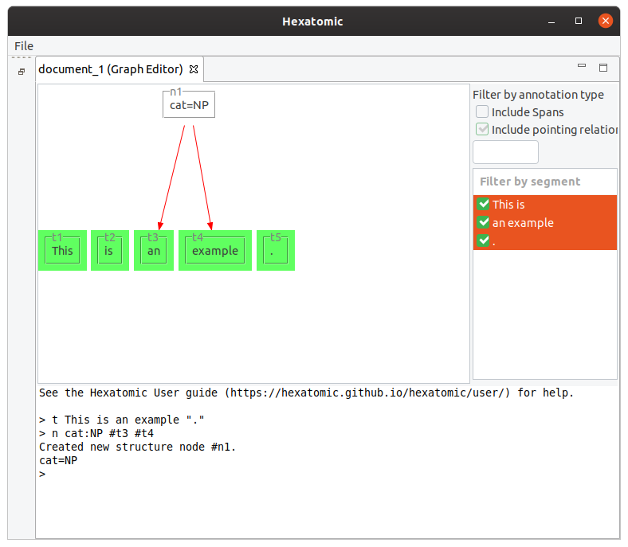
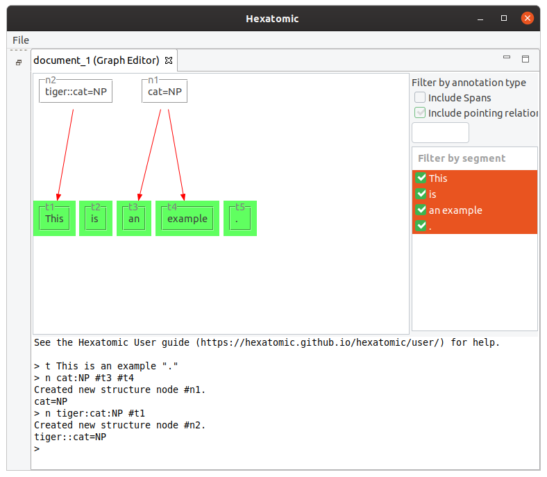

# Graph Editor

The graph editor allows visualizing and annotation graphs.
It is a general visualization that aims to display all possible types of annotation as a graph.


On the right side of the interface, you can select which span to show.
Select more than one span by holding the <kbd>Ctrl</kbd> key while clicking on the segment.

## Console

The graph editor contains a console, which you can use to manipulate the annotation graph.
You first enter a command by entering it as text behind the so-called prompt `> ` and pressing <kbd>Enter</kbd>.


Commands typically start with its name and a list of arguments. The arguments are specific to each command but can share similar syntax.
Hexatomics command line syntax is similar to the one of [GraphAnno](https://github.com/LBierkandt/graph-anno/blob/master/doc/GraphAnno-Documentation_en.pdf).

Currently, the following commands are supported.

### Tokenize: `t`

Tokenize the given argument string and add the tokens to the annotation graph.
String values can be enclosed in quotes, e.g., for punctuation and for tokens that include whitespace.

#### Examples

```
t This is an example "."
```

This command will result in 5 tokens: `[This] [is] [an] [example] [.]`.


If you call `t` again, the new token will be appended to the end.
E.g. calling `t Not .` will result in 7 tokens in total: `[This] [is] [an] [example] [.] [Not] [.]`.
Note that the dot is not escaped in this example.


### Tokenize before (`tb`) and after (`ta`)

Tokenize the given argument string and add the tokens to the annotation graph before or after a given reference token.

#### Examples

Starting with an initial text with the two tokens `[This] [text]` (first one is called "t1" and the second one "t2"),
executing

```
tb #t2 very simple
```

will append the two new tokens *before* the second token: `[This] [very] [simple] [text]`.
Given the new tokens, calling
```
ta #t1 is a
```
will insert the two new tokens *after* the first token: `[This] [is] [a] [very] [simple] [text]`.


### New node: `n`

The command `n` will create a new node and optionally add annotations and dominance relations to existing nodes.
Each of its new annotation arguments has the form `name:value` or `namespace:name:value`.
Arguments starting with `#` refer to the node names to which dominance edges are added (e.g. `#someNodeName`).

The name of the newly created node is returned if creating the node was successful.

#### Examples

Starting with the tokens `[This] [is] [an] [example] [.]`, the following command will group "an example" to a node
with the label "cat=NP".

```
n cat:NP #t3 #t4
```


```
n pos:NN lemma:house #t1 #t2
```

This following command creates a new node using the namespace "tiger" for the annotation.
```
n tiger:cat:NP #t1
```


You can mix general dominance nodes and tokens in the command.
Also, the number of dominated nodes is not restricted
```
n cat:VP #t2 #n1
n cat:S #n2 #n3 #t5
```


### New edge: `e`

You can add two types of edges: dominance relations (e.g. for syntax trees) and more general pointing relations.
Dominance edges are created with the syntax `e #source > #target` where `#source` is a node reference to the source node and `#target` a node reference to the target node.
For pointing relations, use `->` instead of `>`.
This syntax is used to reference edges in general, e.g., when annotating or deleting them.
As with the new nodes, initial annotations can be added as arguments.

### Example

```
e #t1 -> #t2 func:adj
```

Adds a pointing relation between `#t1` and `#t2` with an annotation named "func" and the value "adj."

### Annotate: `a`

Adds or updates annotations to existing nodes.
Give the referenced nodes (with the `#nodeName` syntax), and the attributes are arguments.
You can delete existing annotations by leaving the value in the attribute empty.

#### Examples

```
a pos:NN #t1 #t2
```
Sets the annotation "pos" to the value "NN" for both nodes "t1" and "t2".

```
a pos: #t1
```
Deletes the "pos" annotation for the "t1" node.


### Delete node: `d`

Deletes any node or edge of the graph.
Give the entities to delete as an argument.

